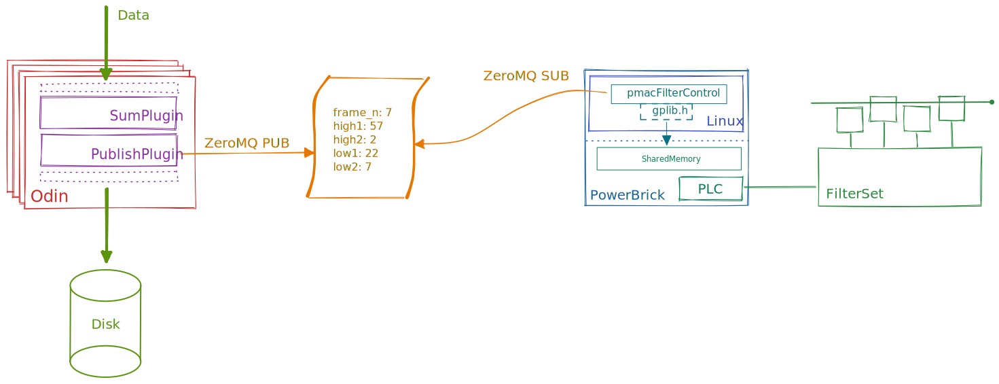

# Automatic Attenuation Design Specification

This document provides an overview of the hardware and software stack and describes the
requirements that the system should meet.

## System Overview



### Hardware

There are six sets of four filters of different materials mounted on a rotary axis.
These axes rotate back and forth a small amount to move the filters in and out of the
beam. pmacFilterControl will assume that a given filter set is selected by moving each
of the 4 motors to position the filter just next to the beam, such that the logic can
move by a set distance to insert a filter and then back to zero counts to remove
The motion controller is a PowerPMAC, or PowerBrick, with an ARM processor.
pmacFilterControl will run within the Linux side of the system and interact with the
PMAC side via the libraries provided with the system.

### Software API

The pmacFilterControl application requires a ZeroMQ publish socket providing json of the
following form:

```{python}
{
    "frame_number": 1,
    "high2": 7,
    "high1": 24,
    "low1": 16,
    "low2": 2
}
```

The `frame_number` determines whether the data should be processed - for example, it
will not be processed if the previous frame was, to allow time for changes to take
affect and avoid overcorrecting. The rest of the values represent the number of pixels
exceeding some number of counts - or below some level. The number of pixels in each bin
that should trigger a filter adjustment are configured with the control parameters with
the same names as keys.

When more than one of these thresholds is exceeded, only one is actioned with the
following precedence:

  1. high2
  2. high1
  3. low2
  4. low1

i.e. reducing attenuation takes precedence over increasing attenuation and larger
attenuation changes supercede smaller attenuation changes.

The target response time from receiving data to the motors being in final position is
20ms. The majority of this time will be required to physically move the motors, so the
software latency should be much lower to fulfill this requirement.

## Modes of Operation

The system needsto be operated in various modes for different use cases

### 1. Automatic Attenuation

The primary mode of operation that the system was designed for. The data stream should
be monitored and the motor positions updated continuously to best effort. If no messages
are received on the data stream to notify of the required attenuation level, the maximum
attenuation level should be set. This will cause the watchdog healthy state to drop for
the visibility of the hardware PLC.

### 2. Single-shot & Reset

In this mode the system will start at max attenuation and then lower the attenuation
until it stablises and then hold this level. In this case, the stream of data messages
will stop and maximum attenuation level should not be set. This is to allow software
time for higher level software to perform step scans, which may take a few seconds.
It may be viable to have a timeout longer than this to reset to max attenuation, however
reacting after many seconds of beam exposure may be redundant, so this may no make
sense.

### 3. Manual Mode

Automatic adjustment of filters is completely disabled allowing manual control of each
filter. The system must not try to change the filter positions based on the data stream
and it should not set max attenuation after a timeout as mode 1 does.

## Filter Motion

Because of mechanics of the system, the filter set in use will determine what whether
moving into position is a positive or negative move. For a given filter set, two of the
filters will have to move in the opposite direction to the other two, however the
directions should be reversed for these axes such that they match.

